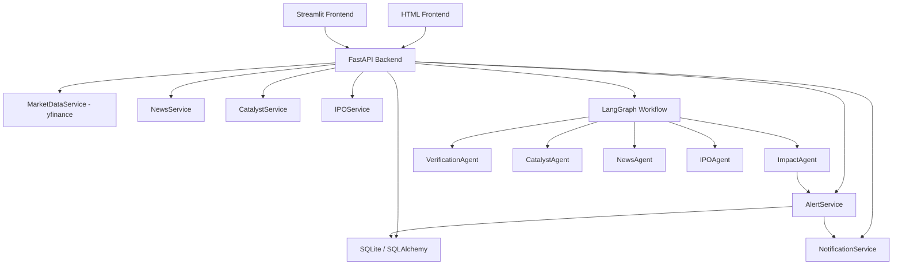

# investment-agent-system

A local-first AI-powered investment intelligence system for monitoring watchlists, portfolios, catalysts, news, IPO events, and generating agent-based impact analysis alerts.

## What this project does

- Tracks a **stock watchlist** with real-time price and daily change.
- Tracks **portfolio holdings** with live P&L calculation.
- Fetches price data with **yfinance** (free, no API key required).
- Triggers **price alerts** when watchlist stocks move above or below a threshold.
- Maintains a **catalyst calendar** (earnings, dividends, splits, investor days, IPOs, regulatory events).
- Collects **news** via Yahoo Finance (free) and supports seeding demo news.
- Uses a **LangGraph multi-agent workflow** to analyze impact and verify findings.
- Supports **6 AI providers**: OpenAI, DeepSeek, KIMI, 智谱 GLM, Gemini, Claude.
- Falls back to **rule-based analysis** when no AI key is configured.
- Sends alerts via **console** and optional **Telegram**.
- Provides an **HTML dashboard** and a **Streamlit dashboard**.

## What this project does NOT do

- It is **not** a trading bot.
- It does **not** place buy or sell orders.
- It does **not** require paid APIs for core functionality.

## Architecture



### LangGraph workflow nodes

```
fetch_watchlist → fetch_market_data → detect_price_alerts
→ fetch_catalysts → fetch_news → analyze_impact
→ verify_analysis → create_alerts → send_notifications → persist_results
```

---

## Quick Start (recommended for beginners)

### Option A — Two commands

```bash
cd investment-agent-system

# 1. First-time setup (installs deps + seeds demo data)
./setup.sh

# 2. Start the system
./start.sh
```

The browser will open the dashboard automatically.

---

### Option B — Docker (no Python install needed)

```bash
cd investment-agent-system
cp .env.example .env          # add your API keys here (optional)
docker compose up
```

- Backend: http://localhost:8000
- Streamlit: http://localhost:8501

---

### Option C – Manual steps

```bash
cd investment-agent-system

# Install dependencies
pip install -r requirements.txt

# Copy and edit environment variables
cp .env.example .env

# Seed demo data (first time only)
PYTHONPATH=. python scripts/seed_demo_data.py

# Start backend (keep this terminal open)
PYTHONPATH=. uvicorn app.main:app --reload

# Open frontend/index.html in your browser
# OR start Streamlit in a second terminal:
# streamlit run frontend/streamlit_app.py
```

### Option D – Windows local launcher

```powershell
cd investment-agent-system

# Start one managed backend + frontend pair
powershell -ExecutionPolicy Bypass -File .\scripts\start_local.ps1

# Check status
powershell -ExecutionPolicy Bypass -File .\scripts\status_local.ps1

# Stop them cleanly
powershell -ExecutionPolicy Bypass -File .\scripts\stop_local.ps1
```

This launcher avoids duplicate Python instances, writes PID files under `.runtime/`,
and is the recommended way to start the project on Windows when you have seen
`python.exe` startup errors from repeated manual launches.

After this change the HTML dashboard is served by FastAPI itself:

- API: `http://127.0.0.1:8023`
- UI: `http://127.0.0.1:8023/ui`

---

## Environment variables

All variables are optional. The system runs without any API keys using rule-based analysis and yfinance for free market data.

| Variable | Default | Description |
|---|---|---|
| `DATABASE_URL` | `sqlite:///./investment_agent.db` | Database connection string |
| `ACTIVE_LLM_PROVIDER` | `openai` | AI provider: `openai` / `deepseek` / `kimi` / `zhipu` / `gemini` / `claude` |
| `OPENAI_API_KEY` | — | OpenAI API key |
| `DEEPSEEK_API_KEY` | — | DeepSeek API key |
| `KIMI_API_KEY` | — | KIMI (Moonshot) API key |
| `ZHIPU_API_KEY` | — | 智谱 GLM API key |
| `GEMINI_API_KEY` | — | Google Gemini API key |
| `CLAUDE_API_KEY` | — | Anthropic Claude API key |
| `TELEGRAM_BOT_TOKEN` | — | Telegram bot token for notifications |
| `TELEGRAM_CHAT_ID` | — | Telegram chat ID |
| `PRICE_ALERT_DEFAULT_THRESHOLD` | `5.0` | Default price move alert threshold (%) |

---

## AI provider configuration

Set your preferred provider in `.env`:

```env
ACTIVE_LLM_PROVIDER=deepseek
DEEPSEEK_API_KEY=sk-xxxxxxxx
```

All providers can also be configured in the **⚙️ System Settings** tab of the HTML dashboard — no `.env` editing required.

If no AI key is provided, the system uses a deterministic rule-based fallback analyzer with no external calls.

## Telegram configuration

```env
TELEGRAM_BOT_TOKEN=7xxx:AAxxx
TELEGRAM_CHAT_ID=123456789
```

Get a bot token from [@BotFather](https://t.me/BotFather). Find your chat ID from `https://api.telegram.org/bot<TOKEN>/getUpdates`.

---

## Running utilities

```bash
# Seed demo watchlist, portfolio, catalysts, and news
PYTHONPATH=. python scripts/seed_demo_data.py

# Run one complete monitoring cycle from CLI (no API server needed)
PYTHONPATH=. python scripts/run_monitor_once.py
```

---

## Running tests

```bash
cd investment-agent-system
PYTHONPATH=. pytest tests/ -v
```

---

## API reference

| Method | Path | Description |
|---|---|---|
| GET | `/health` | Health check |
| GET | `/dashboard/summary` | Aggregated stats |
| GET | `/watchlist` | List active watchlist items |
| POST | `/watchlist` | Add watchlist item |
| DELETE | `/watchlist/{id}` | Remove watchlist item |
| GET | `/portfolio` | List portfolio positions |
| POST | `/portfolio` | Add portfolio position |
| DELETE | `/portfolio/{id}` | Remove portfolio position |
| GET | `/portfolio/summary` | Positions enriched with live P&L |
| GET | `/prices/{ticker}` | Live quote for any ticker |
| GET | `/news/live/{ticker}` | Live news from Yahoo Finance (free) |
| POST | `/monitor/run-once` | Trigger one monitoring cycle |
| GET | `/alerts` | Recent alerts |
| GET | `/catalysts` | Catalyst calendar |
| GET | `/news` | Stored news items |
| GET | `/analyses` | AI impact analyses |
| GET | `/config/models` | LLM provider status |
| GET | `/config/settings` | All settings (API keys masked) |
| POST | `/config/settings` | Update settings / write .env |

Full interactive docs: http://localhost:8000/docs

---

## Future roadmap

- Real company news API integration (Finnhub, NewsAPI, etc.)
- HKEX IPO and market event connectors
- User authentication and saved dashboards
- PostgreSQL deployment support
- Richer AI workflow with feedback loop
- Scheduled monitoring (cron / background task)
