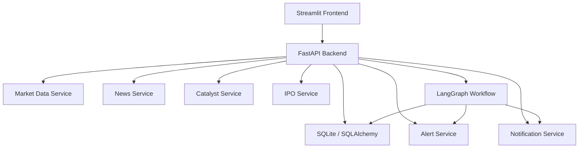

# investment-agent-system

A local-first investment intelligence system for monitoring watchlists, portfolios, catalysts, news, IPO events, and generating agent-based impact analysis alerts.

## What this project does

- Tracks a stock watchlist and portfolio holdings.
- Fetches price data with yfinance.
- Triggers alerts when watchlist stocks move above or below a threshold.
- Maintains a catalyst calendar for earnings, dividends, splits, investor days, company events, IPOs, regulatory updates, and more.
- Collects demo news and IPO/market event data.
- Uses a multi-agent workflow to analyze impact and verify findings.
- Provides a Streamlit dashboard.

## What this project does not do

- It is not a trading bot.
- It does not place buy or sell orders.
- It does not require paid APIs for MVP functionality.

## Architecture



## Setup

1. Clone or copy the repository.
2. Create a virtual environment with Python 3.11+.
3. Install dependencies:

```bash
python -m pip install -r requirements.txt
```

4. Copy `.env.example` to `.env` and update values.

## Running the backend

```bash
uvicorn app.main:app --reload
```

## Running the frontend

```bash
streamlit run frontend/streamlit_app.py
```

## Seeding demo data

```bash
python scripts/seed_demo_data.py
```

## Running one monitoring cycle

```bash
python scripts/run_monitor_once.py
```

## Environment variables

- `OPENAI_API_KEY` - Optional OpenAI API key for agent analysis.
- `DATABASE_URL` - SQLite by default, e.g. `sqlite:///./investment_agent.db`.
- `TELEGRAM_BOT_TOKEN` - Optional Telegram bot token.
- `TELEGRAM_CHAT_ID` - Optional Telegram chat ID.
- `PRICE_ALERT_DEFAULT_THRESHOLD` - Default threshold for price move alerts.

## OpenAI configuration

If `OPENAI_API_KEY` is provided, the ImpactAgent will use OpenAI for richer analysis. If missing, the system falls back to a deterministic rule-based analyzer.

## Telegram configuration

If `TELEGRAM_BOT_TOKEN` and `TELEGRAM_CHAT_ID` are set, alerts are sent to Telegram in addition to console output.

## Future roadmap

- Add real company news API integration.
- Add HKEX IPO and market event connectors.
- Add user authentication and saved dashboards.
- Add PostgreSQL deployment support.
- Add richer AI workflow and feedback loop.
